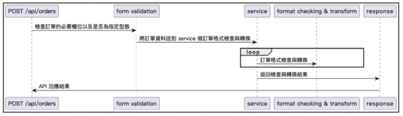
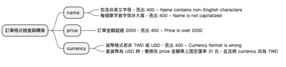

# traveler
## 附上原始題目

### 請利用 Python 任意框架 實作一個提供訂單格式檢查與轉換的 API
1. 此應用程式將有一支 endpoint 為 POST `/api/orders` 的 API 作為輸入點
2. 此 API 將以以下固定的 JSON 格式輸入, **並請使用 Python 語言進行實作,框架不限,若未使用需求設計,則不予給分**
3. 請按照循序圖實作此 API 的互動類別及其衍生類別。**實作之類別需符合物件導向設計
原則 SOLID 與設計模式。並於該此專案的 README.md 說明您所使用的 SOLID 與
設計模式分別為何**。
4. 此 API 需按照以下心智圖之所有情境,處理訂單檢查格式與轉換的功能。
5. 以下所有情境皆需**附上單元測試,覆蓋成功與失敗之案例**。
6. 請使用 docker 包裝您的環境。若未使用 docker 或 docker-compose 不予給分
7. 實作結果需以 GitHub 呈現。若未使用不予計分

```json
{
  "id": "A0000001",
  "name": "Melody Holiday Inn",
  "address": {
    "city": "taipei-city",
    "district": "da-an-district",
    "street": "fuxing-south-road"
  },
  "price": "2050",
  "currency": "TWD"
}
```

### 循序圖


### 心智圖

- name
    - 若有非英文字母，丟出400 - Name contains non-English characters
    - 每個單字自首非大寫，丟出400 - Name is not capitalized
- price
    - 訂單金額超過200，拋出400，Price is over 2000
- currency
    - 貨幣格式若非TWD或USD，丟出400 - Currency format is wrong
    - 當貨幣為非USD時，需修改price金額承上固定匯率31元，並且將 currency 為 TWD

---
## 啟動專案

### 啟動服務
1. 配置環境變數在 `~/traveler/.env`
   ```
   SECRET_KEY=5566neverdie
   DB_USER=unicorn_user
   DB_PASS=magical_password
   DB_HOST=postgres
   DB_NAME=postgres
   ```
2. git clone專案後
    ```bash
    docker-compose up -d --build
    ```
3. API server expose 5000 port，提供以下api
   1. `/api/order` POST: 創建資料
      1. payload
         ```json
         {
           "id": "A0000002",
           "name": "Melody Holiday Inn",
           "address": {
               "city": "taipei-city",
               "district": "da-an-district",
               "street": "fuxing-south-road"
           },
           "price": "20",
           "currency": "USD"
         }
         ```
      2. response
         ```json
         {
           "code": 200,
           "data": {
               "address": {
                   "city": "taipei-city",
                   "district": "da-an-district",
                   "street": "fuxing-south-road"
               },
               "currency": "USD",
               "id": "A0000002",
               "name": "Melody Holiday Inn",
               "price": "620.00"
           }
         }
         ```
   2. `/api/order` GET: 取得資料
      1. response
         ```json
          {
           "code": 200,
           "data": [
               {
                   "address": {
                       "city": "taipei-city",
                       "district": "da-an-district",
                       "street": "fuxing-south-road"
                   },
                   "currency": "USD",
                   "id": "A0000002",
                   "name": "Melody Holiday Inn",
                   "price": "620.00"
               }
           ],
           "meta": {
               "page": 1,
               "pages": 1,
               "per_page": 20,
               "total": 1
           }
         }       
         ```
   2. `/api/order/<id>` GET: 取得單一資料
      1. response
         ```json
          {
           "code": 200,
           "data": {
                   "address": {
                       "city": "taipei-city",
                       "district": "da-an-district",
                       "street": "fuxing-south-road"
                   },
                   "currency": "USD",
                   "id": "A0000002",
                   "name": "Melody Holiday Inn",
                   "price": "620.00"
           }
         }       
         ```

## 設計
### OOP原則
為了設計出具有彈性的父類別，提供開發RESTful API server，因此設計了
`Service` 這個類別，所有的RESTful API都是繼承此類別
1. 封裝：Service 類別將所有與數據模型相關的操作封裝在一起，這符合封裝（Encapsulation）的原則。
2. 繼承：類別是可繼承的（通過 Service.__subclasses__() 實現類別查找機制），未來可以擴展並覆寫其行為。
3. 多型：雖然沒有明顯的多型（Polymorphism）實現，但透過子類繼承，類別行為可以被覆寫，這一點仍然具備。

### SOLID原則 - 分析
1. 單一職責原則（Single Responsibility Principle, SRP）:
   - `Service` 類別的責任在於處理與模型的數據庫交互，大多數方法專注於這一點，因此符合單一職責原則。
   不過，某些方法（如 `dispatch_model_event` 和 `dispatch`）引入了事件處理邏輯，這可能偏離了單一職責原則。
2. 開放封閉原則（Open/Closed Principle, OCP）：
   - `Service` 類別基本上是開放擴展的，可以繼承並覆寫行為。
   - 不過，某些方法（如 `to_filter` 中的運算符邏輯）是直接寫在類別內部的，當需要新增新的篩選條件時，可能會修改原始代碼。可以考慮將運算邏輯提取到獨立的策略類別或設計模式中，使其可以更靈活地擴展。
3. 里氏替換原則（Liskov Substitution Principle, LSP）：
   - 從設計上來看，子類應該能夠替換父類 `Service` 而不破壞系統的行為。這一點大體符合 LSP，尤其是通過 `get_service` 方法來動態選擇具體服務類別。
   - 但 `__model__` 和 `__query_params_forbidden__` 這兩個屬性需要每個子類手動設置，這樣可能會導致子類沒有正確設置時的行為異常，這部分可以通過抽象基類強化。
4. 介面隔離原則（Interface Segregation Principle, ISP）：
   - 這個原則要求接口不要強迫使用者依賴它們不需要的方法。目前來看，`Service`類別的方法較為通用，但所有繼承的子類必須使用或覆寫所有方法，這可能對特定需求的子類有些不必要的負擔。
5. 依賴反轉原則（Dependency Inversion Principle, DIP）：
    - `Service` 類別直接依賴於 `SQLAlchemy` 的 `db.session` 進行操作。雖然這符合簡單需求，但並不符合依賴反轉原則。


## 測試
### 執行測試
1. 進入後端服務容器中
    ```bash
    docker-compose exec backend bash
    ```
2. 執行pytest指令
    ```bash
    pytest -v -s
    ```
### 測試案例
| 測試案例                  | 輸入                                                                                               | 預期狀態碼 | 預期訊息                           |
|--------------------------|--------------------------------------------------------------------------------------------------|------------|-----------------------------------|
| 測試 `name` 包含非英文字母 | `{ "id": "A0000002", "name": "Melody Holiday 界", "address": { "city": "taipei-city", "district": "da-an-district", "street": "fuxing-south-road" }, "price": "1000", "currency": "USD" }` | 400        | Name contains non-English characters |
| 測試 `name` 首字母非大寫    | `{ "id": "A0000002", "name": "melody Holiday Inn", "address": { "city": "taipei-city", "district": "da-an-district", "street": "fuxing-south-road" }, "price": "1000", "currency": "USD" }` | 400        | Name is not capitalized            |
| 測試 `price` 超過 2000      | `{ "id": "A0000002", "name": "Melody Holiday Inn", "address": { "city": "taipei-city", "district": "da-an-district", "street": "fuxing-south-road" }, "price": "200000", "currency": "USD" }` | 400        | Price is over 2000                 |
| 測試 `currency` 格式錯誤    | `{ "id": "A0000002", "name": "Melody Holiday Inn", "address": { "city": "taipei-city", "district": "da-an-district", "street": "fuxing-south-road" }, "price": "1000", "currency": "JPY" }` | 400        | Currency format is wrong           |
| 測試非 `USD` 貨幣           | `{ "id": "A0000002", "name": "Melody Holiday Inn", "address": { "city": "taipei-city", "district": "da-an-district", "street": "fuxing-south-road" }, "price": "1000", "currency": "TWD" }` | 200        | None                               |

